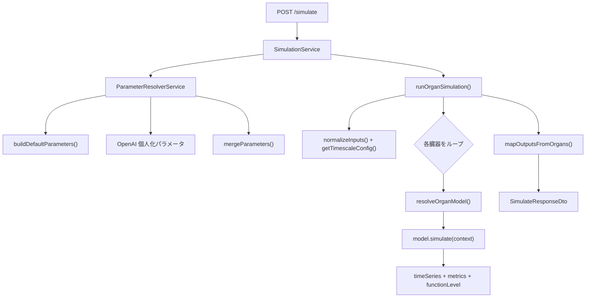

# シミュレーションアルゴリズム

HitoSim Body API における人体シミュレーションの設計・実行フロー・数理モデルを説明するドキュメントです。

## 概要

本プロジェクトのシミュレーションは、**Mathematical Medicine（数理医学）** の文献に基づく臓器別数理モデルを用い、ユーザーの生活習慣入力と個人プロファイルから健康指標の時系列を算出します。

重要な設計方針:

- **臓器モデルは独立実行** — 各臓器は同じ生活習慣入力と個人化パラメータを共有しますが、シミュレーション中に臓器間で状態をやり取りしません（例: 膵臓の血糖値は肝臓の糖新生にフィードバックしません）。
- **パラメータの個人化と計算の分離** — OpenAI はパラメータ推定のみを担当し、数値積分・代数計算は TypeScript 実装が担当します。
- **混合忠実度** — 膵臓は ODE（常微分方程式）、心臓・肺は代数式、骨格筋・脂肪組織はオイラー法による状態更新など、臓器ごとに実装方式が異なります。

## 全体アーキテクチャ



### 関連ソースファイル

| ファイル | 役割 |
|----------|------|
| `src/simulation/simulation.controller.ts` | HTTP エントリポイント (`POST /simulate`) |
| `src/simulation/simulation.service.ts` | パラメータ解決 → エンジン呼び出しのオーケストレーション |
| `src/simulation/parameter-resolver.service.ts` | デフォルトパラメータ生成と OpenAI による個人化 |
| `src/organs/simulation-engine.ts` | シミュレーションコア（`runOrganSimulation`） |
| `src/organs/registry.ts` | 臓器 ID / 名称 → モデル実装の解決 |
| `src/organs/utils/simulation-utils.ts` | タイムスケール、入力正規化、オイラー積分、トレンド判定 |
| `src/organs/output-mapper.ts` | 臓器結果 → ユーザー向けアウトプットへのマッピング |
| `src/organs/models/*.model.ts` | 8 臓器の個別数理モデル |
| `src/organs/constants.ts` | 個人差のない物理・生理定数 |
| `src/organs/parameters/defaults.ts` | 年齢・性別・体格からの決定論的パラメータ |
| `src/reference/models-catalog.ts` | 方程式・引用文献のカタログ（`GET /reference`） |

## 実行フロー（5 フェーズ）

### フェーズ 1: パラメータ解決

`SimulationService.runSimulation()` が `ParameterResolverService` を呼び出します。

1. **デフォルト生成** — `buildDefaultParameters()` が年齢・性別・身長・体重・体脂肪率・安静時心拍数から臓器パラメータを算出します。
2. **AI 個人化（任意）** — OpenAI にユーザープロファイル・目的・生活習慣入力・デフォルト値を渡し、臓器パラメータの上書き値と根拠（`rationale`）を JSON で取得します。
3. **マージとクランプ** — `mergeParameters()` でデフォルトと AI 推定値を統合し、生理学的に妥当な範囲にクランプします。
4. **フォールバック** — OpenAI 呼び出しが失敗した場合、`parameterSource: "defaults"` としてデフォルト値のみを使用します。

物理定数（大気圧、FiO₂、脂肪エネルギー密度 7700 kcal/kg など）は `constants.ts` に固定され、AI やプロファイルでは変更しません。

### フェーズ 2: コンテキスト構築

`runOrganSimulation()` 内で `SimulationContext` を組み立てます。

```typescript
interface SimulationContext {
  timescale: Timescale;       // hourly | daily | weekly | monthly
  stepCount: number;          // 時間ステップ数
  labels: string[];           // 各ステップのラベル
  dtHours: number;            // 1 ステップあたりの時間（時間単位）
  inputs: NormalizedInputs;   // 正規化された生活習慣入力
  userProfile: UserProfile;
  parameters: OrganParametersMap;
}
```

### フェーズ 3: 臓器別シミュレーション

リクエストで指定された各臓器について:

1. `resolveOrganModel(organId, organName)` でモデル実装を解決（エイリアス対応: `骨格筋`, `skeletal_muscle`, `muscle` など）
2. 対応パラメータがなければ `unresolvedOrgans` に追加してスキップ
3. `model.simulate(context)` を実行
4. 結果を `organId` と `model.key` の両方でインデックス

### フェーズ 4: アウトプットマッピング

`mapOutputsFromOrgans()` が臓器の時系列やメトリクスを、リクエストされたアウトプット ID に変換します。

- マッピング定義がある場合 → 対応臓器の `timeSeries` または特定 `metric` を使用
- マッピングがない場合 → 全臓器の時系列の**ステップごとの平均**を複合指標として生成

### フェーズ 5: トレンド判定

`computeTrend()` が時系列の先頭 1/3 と末尾 1/3 の平均を比較し、±2% を閾値として `increasing` / `decreasing` / `stable` を返します。

## タイムスケール設定

`getTimescaleConfig()` により、タイムスケールごとにステップ数・時間刻み・ラベルが決まります。

| タイムスケール | ステップ数 | `dtHours` | ラベル例 |
|----------------|-----------|-----------|----------|
| `hourly` | 24 | 1 時間 | `00:00` … `23:00` |
| `daily` | 7 | 24 時間 | `1日目` … `7日目` |
| `weekly` | 4 | 168 時間（7 日） | `1週目` … `4週目` |
| `monthly` | 6 | 720 時間（約 30 日） | `1月目` … `6月目` |

`dtHours` は ODE の時間刻みや、1 ステップあたりのエネルギー・炭水化物摂取量のスケーリングに使われます。

## 生活習慣入力の正規化

`normalizeInputs()` がリクエストの `inputs` 配列を `NormalizedInputs` に変換します。日本語名・英語名のエイリアスに対応しています。

| フィールド | デフォルト値 | エイリアス例 |
|-----------|-------------|-------------|
| `exerciseMinutes` | 30 | 運動, exercise |
| `sleepHours` | 7 | 睡眠, sleep |
| `proteinGrams` | 60 | タンパク質, protein |
| `calorieIntake` | 2000 | 摂取カロリー |
| `calorieExpenditure` | 2000* | 消費カロリー |
| `waterIntakeMl` | 2000 | 水分 |
| `stressLevel` | 3 | ストレス |
| `restingHeartRate` | 70 | 心拍数 |
| `carbohydrateGrams` | 250 | 炭水化物 |
| `fatGrams` | 65 | 脂質 |

\* `calorieExpenditure` が未指定の場合:

```
calorieExpenditure = 1600 + exerciseMinutes × 8 + (8 - sleepHours) × 20
```

## 数値積分と位相変調

### フォワード・オイラー法

状態変数を持つモデル（骨格筋、脂肪組織、肝臓、腎臓など）は `integrateEuler()` を使用します。

```
x[i+1] = x[i] + f(x[i], i) × dt
```

### 正弦波位相変調

多くのモデルで、ステップ内の変動（運動ピーク、日内変動の近似）を表現するために次の位相を使います。

```
phase = i / (stepCount - 1)
modulation = sin(π × phase)
```

これは明示的な概日リズム時計ではなく、期間内の変動パターンを近似するための簡易手法です。

## 臓器別モデル詳細

### 心臓 — `windkessel_three_element`

**方式:** 代数計算（ODE 積分なし）

```
exerciseFactor = clamp(exerciseMinutes / 60, 0, 1.5)
stressFactor   = stressLevel / 10
sleepFactor    = clamp((sleepHours - 5) / 3, -0.3, 0.3)

R = vascularResistance + stressFactor × 0.15
C = vascularCompliance - stressFactor × 0.1

各ステップ:
  SV = basalSV × (1 + 0.25 × exerciseFactor + sleepFactor × 0.05)
  HR = basalHR + exerciseFactor × 40 × sin(π × phase) + stressFactor × 10
  CO = (SV × HR) / 1000   [L/min]
```

`functionLevel = 60 + exercise×20 + sleep×10 - stress×15`（0〜100 にクランプ）

**出力時系列:** 心拍出量 CO

---

### 肺 — `alveolar_gas_exchange`

**方式:** 代数計算

```
RR = basalRR + exerciseFactor × 25 × sin(π × phase)
VT = basalVT + exerciseFactor × 1.5 × sin(π × phase)
VE = RR × VT × sleepFactor
VO₂ = VE × 0.05 × (1 + exerciseFactor) × (vo2MaxEstimate / 40)
```

参考メトリクスとして肺胞気方程式による PAO₂ も算出します。

**出力時系列:** 酸素摂取量 VO₂

---

### 膵臓 — `bergman_minimal`

**方式:** 明示的オイラー法による ODE（Bergman 最小モデル）

状態変数: `G`（血糖値）、`X`（インスリン作用コンパートメント）

```
carbRate   = (carbohydrateGrams / 24) × dtHours
mealPulse  = carbRate × (1 + sin(π × i / stepCount)) × 0.5
exerciseEffect = (exerciseMinutes / 60) × 0.01 × G

dG = (-p1 × (G - Gb) - X × G + mealPulse - exerciseEffect) × dtHours
insulinRelease = p3 × max(0, G - Gb) × 100 × dtHours
dX = (-p2 × X + insulinRelease) × dtHours

G ← clamp(G + dG, 60, 250)
X ← max(0, X + dX)
```

- `p2` は定数 `BERGMAN_P2 = 0.025 min⁻¹`
- インスリン感受性: `SI = 1 / (p1 + p3 × 100)`

**出力時系列:** 血糖値 G

---

### 肝臓 — `hepatic_glucose_production`

**方式:** グリコーゲンに対するオイラー積分 + 代数 HGP

```
HGP(phase) = HGP₀ - exerciseSuppressionCoeff × exerciseFactor × 10 × sin(π × phase)

グリコーゲン変化:
  intake      ∝ carbohydrateGrams × 4 / 24
  utilization ∝ calorieExpenditure / 2000 × 0.5 × dtHours
  dGlycogen   = intake - HGP × 0.1 × dtHours - utilization
```

**出力時系列:** 肝糖新生量 HGP（グリコーゲン量ではない）

---

### 腎臓 — `renal_autoregulation_gfr`

**方式:** 体液量に対するオイラー積分 + 代数 GFR

```
MAP = MAP_REFERENCE + stressLevel × 0.02 × 20 × sin(π × phase)
GFR = GFR₀ × (1 - kp × (MAP - MAP_REFERENCE)) × (1 + TGF_GAIN × 0.1)

体液量変化:
  waterIn  = (waterIntakeMl / 24 / 1000) × dtHours
  waterOut = 0.05 × dtHours
  dVolume  = waterIn - waterOut - KIDNEY_FILTRATION_COEFF × GFR × dtHours
```

**出力時系列:** GFR（糸球体濾過量）

---

### 骨格筋 — `muscle_protein_turnover`

**方式:** オイラー積分

```
exerciseFactor = exerciseMinutes / 60
proteinFactor  = proteinGrams / 60
targetMass     = mEq × (1 + 0.08 × exerciseFactor + 0.05 × proteinFactor)

dM/dt = ks × max(0, targetMass - M) × dtHours
      - kd × max(0, M - mEq × 0.95) × dtHours
```

**出力時系列:** 筋肉量 M

---

### 脳 — `cerebral_metabolic_rate`

**方式:** 代数計算

```
neuralActivity = 1 + stress × 0.3 × sin(π × phase) + exercise × 0.15 × sin(π × phase)
MAP = MAP_REFERENCE + exercise × 15 × sin(π × phase)
CBF = baselineCbf + neurovascularCoupling × (MAP - MAP_REFERENCE)
glucoseFactor = 1 + (carbohydrateGrams - 250) / 1000

CMRO₂ = baselineCmro2 × sleepFactor × neuralActivity × glucoseFactor × (CBF / baselineCbf)
```

**出力時系列:** 脳代謝率 CMRO₂

---

### 脂肪組織 — `hall_energy_balance`

**方式:** オイラー積分（Hall エネルギー平衡）

```
daysPerStep = dtHours / 24
intake      = intakeBase + sin(π × phase) × intakeBase × 0.05
expenditure = expenditureBase + exerciseMinutes × 8 × sin(π × phase)
Δfat        = (intake - expenditure) × daysPerStep / RHO_FAT_KCAL_PER_KG
```

`RHO_FAT_KCAL_PER_KG = 7700 kcal/kg`

**出力時系列:** 体脂肪量

## 普遍定数

`src/organs/constants.ts` に定義。個人化の対象外です。

| 定数 | 値 | 用途 |
|------|-----|------|
| `PATM` | 760 mmHg | 肺胞気方程式 |
| `PH2O` | 47 mmHg | 肺胞気方程式 |
| `FIO2` | 0.21 | 吸入酸素分率 |
| `RESPIRATORY_QUOTIENT` | 0.8 | 呼吸商 |
| `RHO_FAT_KCAL_PER_KG` | 7700 | 脂肪量換算 |
| `MAP_REFERENCE` | 90 mmHg | 基準動脈圧 |
| `PACO2_REFERENCE` | 40 mmHg | 基準 CO₂ 分圧 |
| `BERGMAN_P2` | 0.025 min⁻¹ | インスリン作用減衰 |
| `KIDNEY_TGF_STRUCTURAL_GAIN` | 0.15 | チューブ・グルオメラーフィードバック |
| `KIDNEY_FILTRATION_COEFF` | 0.001 | 濾過による体液減少 |
| `KIDNEY_PRESSURE_SENSITIVITY` | 0.005 | GFR の血圧応答 |

## アウトプットマッピング

`output-mapper.ts` の `OUTPUT_SOURCE_MAP` が、アウトプット ID と臓器結果の対応を定義します。

| アウトプット ID | ソース臓器 | データ種別 |
|----------------|-----------|-----------|
| `muscle_mass`, `strength` | `skeletal_muscle` | 時系列 |
| `body_fat`, `fat_mass`, `weight` | `adipose_tissue` | 時系列 |
| `blood_glucose`, `glucose` | `pancreas` | 時系列 |
| `insulin_sensitivity` | `pancreas` | スカラーメトリクス |
| `vo2max`, `vo2`, `endurance` | `lung` | 時系列 |
| `cardiac_output`, `heart_rate` | `heart` | 時系列 |
| `gfr`, `kidney_function` | `kidney` | 時系列 |
| `hydration` | `kidney` | 体液量メトリクス |
| `liver_function`, `hgp` | `liver` | 時系列 |
| `cognitive_performance`, `energy_level` | `brain` | 時系列 |

マッピングにないアウトプットは、全臓器時系列の平均から推定されます。

## 臓器モデル一覧

| 臓器 | modelKey | 実装ファイル |
|------|----------|-------------|
| 心臓 | `windkessel_three_element` | `src/organs/models/heart.model.ts` |
| 肺 | `alveolar_gas_exchange` | `src/organs/models/lung.model.ts` |
| 膵臓 | `bergman_minimal` | `src/organs/models/pancreas.model.ts` |
| 肝臓 | `hepatic_glucose_production` | `src/organs/models/liver.model.ts` |
| 腎臓 | `renal_autoregulation_gfr` | `src/organs/models/kidney.model.ts` |
| 骨格筋 | `muscle_protein_turnover` | `src/organs/models/skeletal-muscle.model.ts` |
| 脳 | `cerebral_metabolic_rate` | `src/organs/models/brain.model.ts` |
| 脂肪組織 | `hall_energy_balance` | `src/organs/models/adipose-tissue.model.ts` |

## 設計上の制約と注意点

1. **非結合型アーキテクチャ** — 臓器間フィードバックは実装されていません。完全な全身統合モデルではなく、複数の独立モデルを並列実行するアンサンブルです。
2. **教育・意思決定支援向けの簡略化** — 臨床診断や治療判断には使用しないでください。
3. **AI の役割は限定的** — OpenAI はパラメータ推定のみ。シミュレーション本体は決定論的です。
4. **未解決臓器** — ID が解決できない、またはパラメータが不足している臓器は `unresolvedOrgans` に列挙され、スキップされます。
5. **functionLevel** — 各臓器が 0〜100 のスカラー「機能レベル」を返します。モデル固有のヒューリスティックであり、医学的スコアリングシステムではありません。

## 参考文献

詳細な方程式と引用文献は以下で確認できます。

- **API:** `GET /reference`
- **ソース:** `src/reference/models-catalog.ts`

主な引用:

- Bergman R.N. et al. (1981) — Bergman 最小モデル
- Westerhof N. et al. (2009) — Windkessel モデル
- Hall K.D. et al. (2011) Lancet — エネルギー平衡
- Sgouralis I. & Layton A.T. (2014) — 腎血流動態
- Phillips S.M. et al. (1997) — 筋タンパク質合成

## 関連ドキュメント

- [README.md](../README.md) — API 利用方法・エンドポイント仕様
- [models-catalog.ts](../src/reference/models-catalog.ts) — 数理モデル定義と文献
